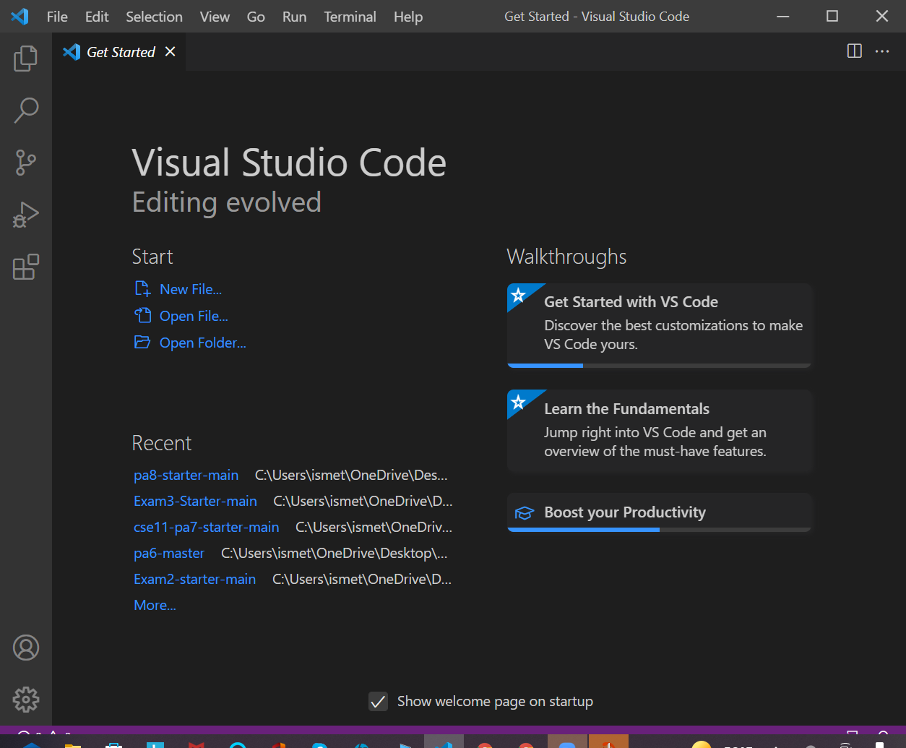
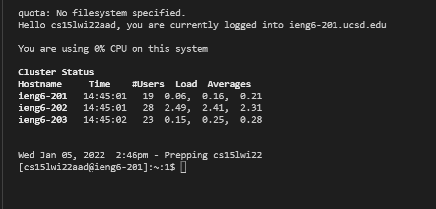
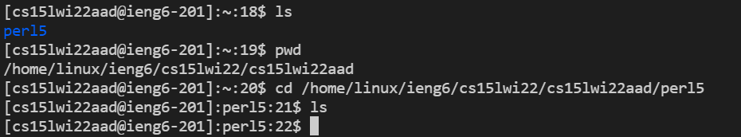
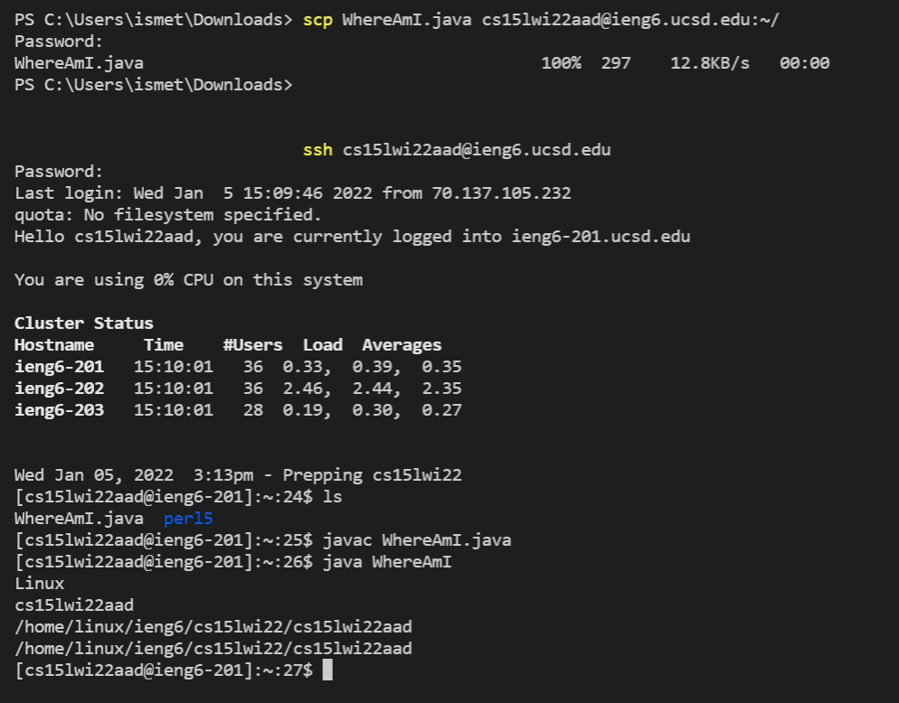

# Week 2 Lab Report
1. Step 1: Install Visual Code Studio
```
I had already installed Visual Code Studio for my CSE 11 class last quarter, so I didn't really do anything for this step.
```






