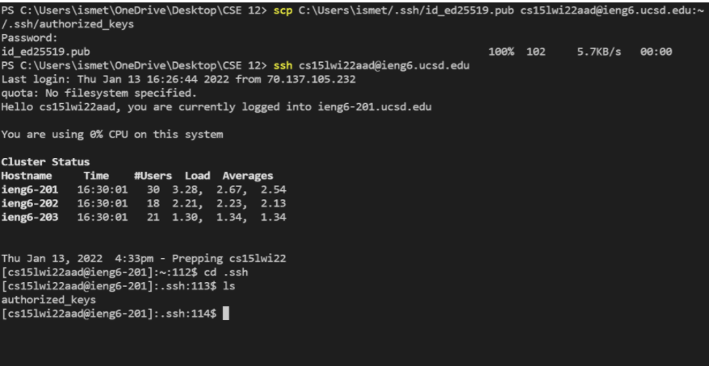

# Week 2 Lab Report
1. Step 1: Install Visual Code Studio

> I had already installed Visual Code Studio for my CSE 11 class last quarter, so I didn't really do anything for this step.

This is an image of my open VSCode:

2. Step 2: Remotely Connecting

> Since I am working on a Windows laptop, I had to follow the extra steps to install OpenSSH Client and OpenSSH Server. I checked and saw that I already > had OpenSSH Client on my laptop, so I thought I was done and ignored all the other necessary steps. This caused problems later on during the lab. But > I was still able to remotely connect to the ieng6 server after resetting my password and waiting for the password to update.
> 
> Later, outside the lab, I OpenSSH Server as well. I was getting some errors with the commands I needed to run, and I realized this was because I
> wasn't opening VSCode as an administrator. I researched how to do that, and then the commands worked.

