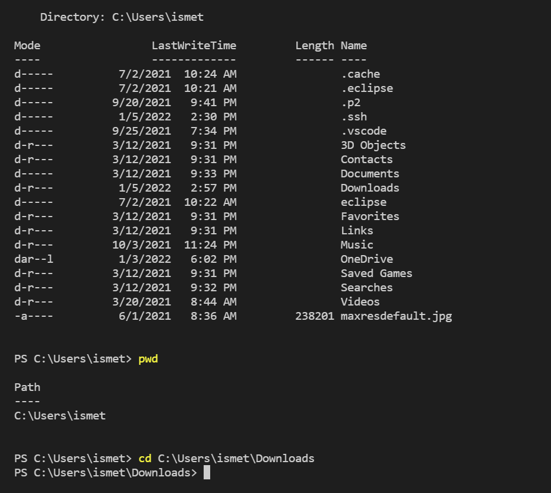

# Lab Report 1 - Week 2

[Class Instructions](https://ucsd-cse15l-w22.github.io/week/week1/)

*This tutorial is for a Windows computer

## Step 1: Installing Visual Code Studio

> Install Visual Code Studio using the link [here](https://code.visualstudio.com/). Make sure to download the Windows version of VSCode.

This is a screenshot of what my VSCode looks like when I open it. Yours might look a little different:


***

## Step 2: Remotely Connecting

> Since you are using a Windows computer, you have to follow the extra steps to install OpenSSH Client and OpenSSH Server. The instructions to do so are [here](https://docs.microsoft.com/en-us/windows-server/administration/openssh/openssh_install_firstuse). Follow these instructions up until the title "Connect to OpenSSH Server." **Make sure you are running VSCode and/or Powershell as an administrator.** If you do not, the commands will not work. [Here](https://docs.microsoft.com/en-us/visualstudio/ide/user-permissions-and-visual-studio?view=vs-2022#:~:text=On%20the%20Windows%20desktop%2C%20right,and%20then%20select%20OK%20again.) are instructions for how to run VSCode as an admin on Windows 10.
> After that, find your account info for the CSE 15L class using [this link](https://sdacs.ucsd.edu/~icc/index.php). It may tell you you need to reset the password for the account. If so, do it. The effects of the password change might take some time to take effect. Your account should have the name cs15lwi22--, where the "--" would be replaced by letters specific to your account.
> To connect to the server, run the command `ssh cs15lwi22--@ieng6.ucsd.edu`, but with the "--" replaced by the letters in your account. If a question about authenticity pops up, answer "yes." It will then ask for the password (that you may have changed in this step). When you type the password in, it doesn't look like you are typing anything, but you are. If the password doesn't work, wait some more. It could just be that the password change hasn't gone into effect yet. If the password works, you will connect to the server.

This is a screenshot of what messages could pop up after the password works:


***

## Step 3: Trying Some Commands
> Once you've connected to the server, you can try out some commands there. You can also log off the server with the command `exit` or by doing Ctrl-D and try some commands on your computer. Since the server uses the Linux OS, and you computer should use the Windows 10 OS, some commands might not work on both of them, or they could work a little differently.
> Some commands are:
- cd (changes directory to the directory you specify after it)
- ls (lists files and directories in the current directory)
- pwd (tells you the name of the current directory)
- mkdir (makes a directory with the name you type after it)
> You can also search the internet for other commands to try

This is an image of the commands on the server:


This is an image of the commands on my laptop:


***

## Step 4: Moving Files with scp
> Using the command `scp`, you can copy your file over to the server. To test this, you can make a java file. The CSE 15L tutorial tells you to create a file with the name "WhereAmI.java" and put in the following code:
```
class WhereAmI {
  public static void main(String[] args) {
    System.out.println(System.getProperty("os.name"));
    System.out.println(System.getProperty("user.name"));
    System.out.println(System.getProperty("user.home"));
    System.out.println(System.getProperty("user.dir"));
  }
}
```
> This java code will print out information about the computer the file is running on, so it is good to test if you are running the file on your computer or on the school server. Make this file on VSCode, then use the command `scp WhereAmI.java cs15lwi22--@ieng6.ucsd.edu:~/`, replacing the "--" as you have done before. Log into the server and use the ls command; you will see that there is now a file named "WhereAmI.java" there. Run the commands `javac WhereAmI.java` and `java WhereAmI` to compile and run the java file. It should print out some information. You can log out of the server and run the same commands on your computer to see the difference in what it prints.

This is an screenshot of me moving "WhereAmI.java" to the school server and running the java file.


***

## Step 5: Setting an SSH Key
> Again, make sure you are connecting to Powershell and/or VSCode as an administrator. Follow [these](https://docs.microsoft.com/en-us/windows-server/administration/openssh/openssh_keymanagement#user-key-generation) instructions up until it says "Deploying the public key." Also, in the part where it says `ssh-add ~\.ssh\id_ed25519` in the instructions, you have to replace the "~" with the location of the .ssh\id_ed25519. It should tell you that information during the key generation process.
> After you've added the private key to ssh-agent, run the command `scp C:\Users\NAME/.ssh/id_ed25519.pub cs15lwi22--@ieng6.ucsd.edu:~/.ssh/authorized_keys`, again replacing the "--". And the "C:\Users\NAME" should be the thing you replaced the "~" with in the previous step. This command copies the public key into the .ssh directory in the server, in a textfile called "authorized_keys." Now, you should be able to use the `scp` and `ssh` commands without entering a password.

This is an screenshot of me connecting to the server without a password:


***

## Step 6: Optimizing Remote Running
> First, I copied a java file I made called "TestFastEdit.java" into the server. I then tried doing the javac and java commands in one line by typing out `ssh cse15lwi22aad@ieng6.ucsd.edu "javac TestFastEdit.java; java TestFastEdit"`. It worked, compiling and running the file in one line. I thought about it for some time and reread the lab instructions to understand how the quotation marks and semi-colons worked in the command line. I came up with the line `scp TestFastEdit.java cs15lwi22aad@ieng6.ucsd.edu:~/; ssh cs15lwi22aad@ieng6.ucsd.edu "javac TestFastEdit.java; java TestFastEdit"` that I thought would copy the file and compile and run it on the school server in one line. It worked. I used a semicolon to separate the scp and ssh commands. Then I put the javac and java commands in between quotation marks and separated by a semicolon. The quotes made sure both commands ran on the server through the ssh command.
> Typing the entire line out took some time, but when I made an edit to the file, I used the up arrow to rerun the command, so it only took a second or two.

This is an image of me copying, compiling, and running the java file on the server in one line:

