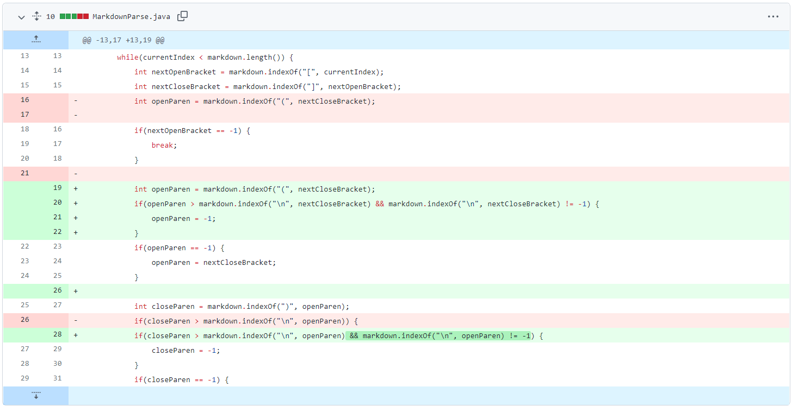
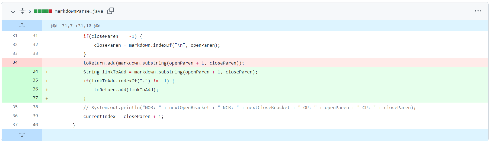
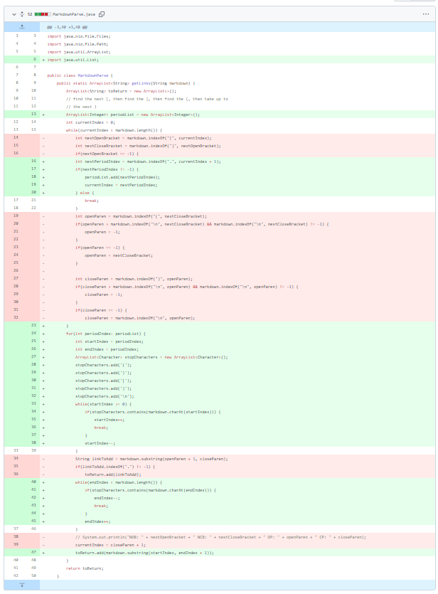

# Lab Report 2 - Week 4

[Back to Main Page](https://ebayraktaroglu.github.io/cse15l-lab-reports/)

## Process

>For these two labs, our objective was to make a program that takes all the links in a markdown file and print them out. Our group was given a basic java file that worked for ideal conditions, but we were supposed to make it work for other unusual cases as well. We worked together in our group on the code, and only some people commited certain parts of the code, so the github commits that I will be showing is from my fork of one of my groupmates' fork of the markdown-parse repo.

## Bug One

>One bug our group encountered occurred when a markdown file contained the information in brackets, but the link wasn't in paranthesis, it would give an `IndexOutOfBoundsException`. [Here](https://github.com/ebayraktaroglu/markdown-parse/blob/e8730c20114c72506184840112ea49158778f291/markdown-test-three.md) is the file that contains the failure-inducing input.

Here is the symptom of this bug (the terminal output):
```
Exception in thread "main" java.lang.StringIndexOutOfBoundsException: begin 0, end -1, length 152
        at java.base/java.lang.String.checkBoundsBeginEnd(String.java:4601)
        at java.base/java.lang.String.substring(String.java:2704)
        at MarkdownParse.getLinks(MarkdownParse.java:18)
        at MarkdownParse.main(MarkdownParse.java:26)
 ```
>The bug was that the original file was using `indexOf` to find the next open and closed parenthesis. In this file, there was no open or closed parenthesis. This means that the `indexOf` returned -1, and when the method tried to add the "link" between the indexes of -1 and -1, it gave an `IndexOutOfBoundsException`. The fix for the bug makes sure to use if statements to check is the `indexOf` is -1, and acts accordingly to avoid the exception.

This is a image of the code change diff:


## Bug Two

>Another bug our group encountered was that the program we wrote got the "link" even if it wasn't a valid one. The file that contained the failure-inducing input was [this one](https://github.com/ebayraktaroglu/markdown-parse/blob/e8730c20114c72506184840112ea49158778f291/test-file4.md). The symptom of this was that the program printed out the text "link goes here!", even though it wasn't a link. Our fix for this was to check if the supposed link had a period in it. If it did, we counted it as a link.

This is an image of the code chagne diff:


## Bug Three

>One more bug our group encountered was when the markdown file ended in a open bracket. When there wasn't a closed bracket to accompany the open bracket, our while loop became an infinite loop as the program kept searching for a closed bracket. This lead to an error that said you were out of memory. The two files that showcased this bug were [this file](https://github.com/ebayraktaroglu/markdown-parse/blob/e8730c20114c72506184840112ea49158778f291/test-file7.md) and [this file](https://github.com/ebayraktaroglu/markdown-parse/blob/e8730c20114c72506184840112ea49158778f291/test-file8.md). We fixed this by changing the way the program worked a lot. We found the period (that a link could contain), and then expanded outward until the program found the parenthesis for the link, which fixed the error in this case. But I think this would cause errors if some text in the markdown file (that wasn't a link) had a period in it.

This is an image of the code chagne diff:


