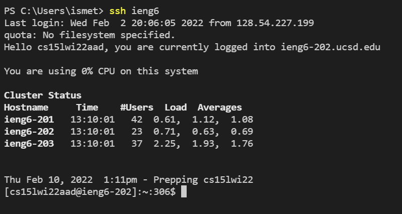

# Lab Report 3 - Week 6

[Back to Main Page](https://ebayraktaroglu.github.io/cse15l-lab-reports/)

# Streamlining ssh Configuration

# Creating config file

>To create a config file on my Windows computer, I figured out where the .ssh directory was, and then I created a file named config and edited the file in Notepad.

This is the .ssh directory:

This is the config file in Notepad:

This is me logging into the server using the nickname:

This is me copying a file into the server using the nickname, and then logging in to see if the file is there:

