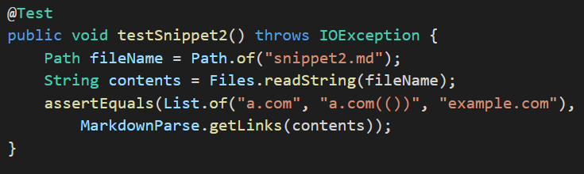
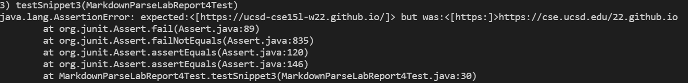

# Lab Report 4 - Week 8

[Back to Main Page](https://ebayraktaroglu.github.io/cse15l-lab-reports/)

[Link to my group's markdown-parse repo](https://github.com/ebayraktaroglu/markdown-parse)

[Link to other group's markdown-parse repo](https://github.com/bimai25/markdown-parse-brandon)

## Snippet 1

## My Group's Implementation

Test:

Output (Test Failed):

Is there a small change that will fix it?

There is no small change that will fix this error, because our group understood the prompt wrong and thought we needed to extract all links, regardless of whether they were in markdown format or not. Because of this, our code finds each period and expands outward to try to find the link the period is in, which creates a lot of errors. Since we haven't even gotten to fixing that, there is no way we can we can account for the backtick on the first line of snippet 1 without first completely changing our code.

## Other Group's Implementation

Test:

Output (Test Failed):

## Snippet 2

## My Group's Implementation

Test:

Output (Test Failed):

Is there a small change that will fix it?

Like I said before, we implemented our markdown-parse completely wrong, so to fix this, we would have to completely change our code, and then account for the (()) being part of the link.

## Other Group's Implementation

Test:

Output (Test Failed):

## Snippet 3

## My Group's Implementation

Test:

Output (Test Failed):

Is there a small change that will fix it?

What I said before applies, but I don't really even know what the error is in this case. There seems to be an error in the test output, because the `java.lang.AssertionError:` text is missing or obscured or something, and one link is outside the brackets that indicate the link is in an ArrayList, so I don't know what's going on with that. Also, when I ran the test a different time, it gave out a **different** output, and I have no idea what is causing that.

Different Output:

## Other Group's Implementation

Test:

Output (Test Failed):

