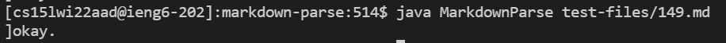
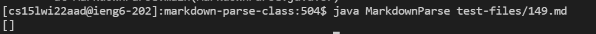
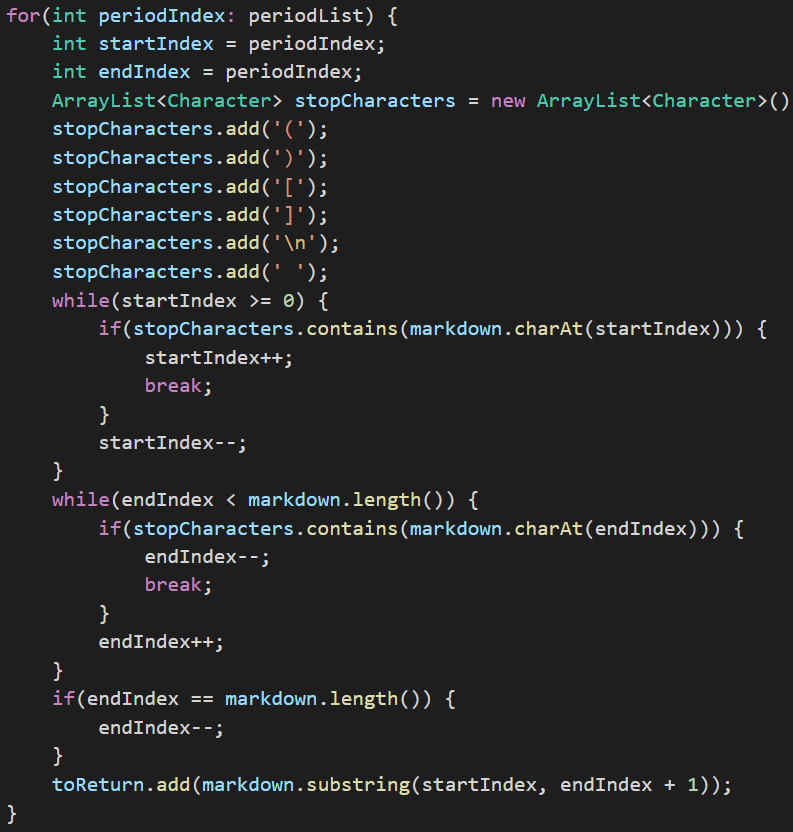
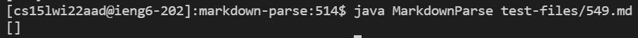
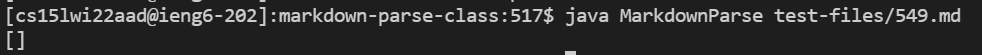
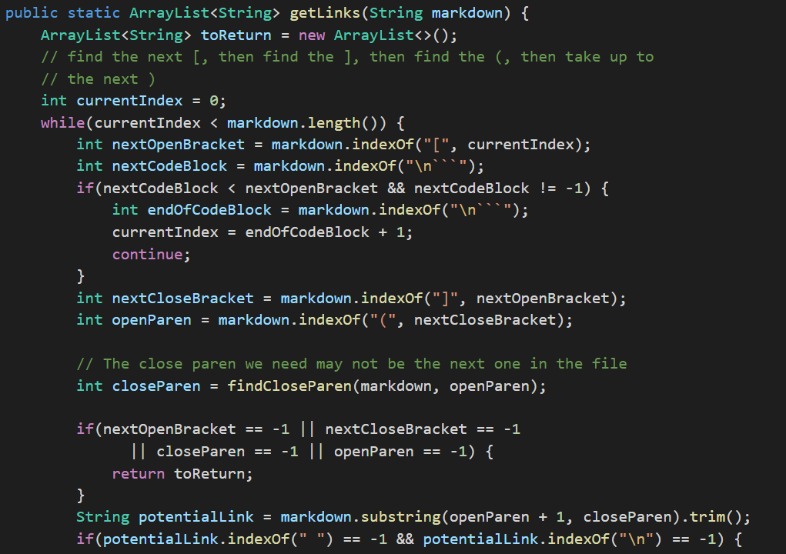

# Lab Report 5 - Week 10

[Back to Main Page](https://ebayraktaroglu.github.io/cse15l-lab-reports/)


## First File: 149.md

```
<table>
  <tr>
    <td>
           hi
    </td>
  </tr>
</table>

okay.
```

### Output for My Group's Implementation:



### Output for the Lab 9 Implementation:



### Explanation:

>I found this difference in results by looking back at my group's lab notes and choosing one of the test files that gave different results for the two implementations. We found this difference using the `dif` command on the text files for the result of all the tests.

>The expected result is an `[]`, since there are no valid links in the Markdown file. This means that my group's implmentation gave the wrong output, while the Lab 9 implementation gave the correct output.

>The bug in my group's implementation that caused this error is that we completely misinterpreted the instructions for markdown-parse, and we thought that we wanted to get all the links, regardless of whether they were in a proper format or not. To do this, we operated under the (flawed) belief that any valid link would have a period in it, so our implementation got each period and expanded outward until we got to a space or other character we defined as not being part of a link, and then took that as a link. Because of this, our implementation took `okay.` to be a link, even thought it wasn't. To fix this, we would have to completely change our implementation to check for the valid link formats in Markdown, rather than any link.

#### Basically all the code has to be changed for this bug to be fixed. Here is part of the bug:




## Second File: 549.md

```
[bar\\]: /uri

[bar\\]

```

### Output for My Group's Implementation:



### Output for the Lab 9 Implementation:



### Explanation:

>To find this file, I looked through some of the test files and tried to pick one I thought would have an interesting result. I tested it on both implementation, and the implementations had different outputs from the expected.

>The expected result is an `[/uri]`, but neither of the implementations detected any links in the file.

>The bug in the Lab 9 implementation is that it only checks the one link type, where the link is formatted like this: `[link](link.com)`. The type of link in this file is a reference link, where the second `[bar//]` basically references the link in the line `[bar\\]: /uri`, so the link `\uri`. The Lab 9 implementation does not check this type of link. To fix this bug, you would have to have the code check if there are reference type links, so if there is text between brackets, but no parenthesis after it, it would have to look for another set of brackets with the same text inside, then check if it has a colon and then text after it, and take that text as a link. This would be a complicated thing to write without messing up the parts that already work.

This is part of the bug, where the code assumes there has to be parenthesis for a valid link to exist in the file:




